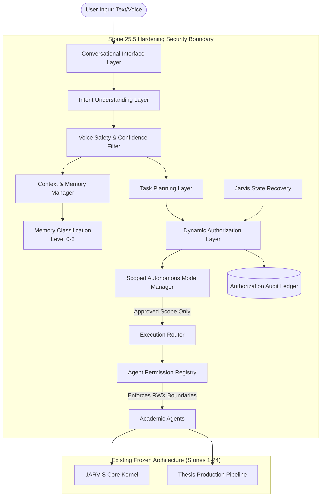

# STONE 25.5: JARVIS Conversational Security Hardening Layer Proposal

## 1. Objective
Transform the validated Stone 25 conversational system into a production-grade, secure conversational foundation. This hardening layer ensures future interfaces (Voice, Visual UI, advanced OS workflows) operate under strict security policies. It enforces that human authority remains supreme, autonomous actions are strictly scoped and temporary, and agents operate as non-authoritative workers.

## 2. Architecture Diagram

## 3. Components

### 3.1 Authorization Audit Ledger
* **Purpose**: Provide a tamper-proof append-only log of all authorization decisions.
* **Storage Contents**: Timestamp, Session ID, User Command, Detected Intent, Authorization State, Activated Scope, Affected Subsystem, and Execution Result.
* **Security**: Read-only to all sub-components except the `AuthorizationManager`. Agents and Memory cannot write to it.

### 3.2 Scoped Autonomous Mode
* **Purpose**: Replace blanket "approve all" with granular permissions.
* **Scopes**: `thesis_writing`, `research`, `review`, `compilation`, `documentation`.
* **Rules**: Approving thesis operations allows Writer/Reviewer/Latex agents but blocks OS commands, file deletion, and external system changes.

### 3.3 Memory Security Hardening
* **Purpose**: Enforce a strict classification model for memory boundaries to prevent intent spoofing.
* **Levels**: 
  * **LEVEL 0**: Temporary conversation memory.
  * **LEVEL 1**: Session memory.
  * **LEVEL 2**: Project/thesis memory.
  * **LEVEL 3**: Permanent user preferences (Read-only for agents).
* **Rules**: Memory content is strictly contextual knowledge. Decisions and authorizations can never originate from memory objects.

### 3.4 Agent Permission Registry
* **Purpose**: Matrix mapping strict Read (R), Write (W), Execute (X) bounds for each agent type.
* **Definitions**:
  * **Research Agent**: R(papers/literature), W(research notes), X(none).
  * **Writer Agent**: R(approved thesis context), W(draft files), X(none).
  * **Reviewer Agent**: R(drafts), W(review comments), X(none).
  * **Build Agent**: R(LaTeX files), W(build outputs), X(compile only).
* **Rules**: Hard block on agents changing system config, activating autonomy, or altering authorization states.

### 3.5 Voice Safety Preparation
* **Purpose**: Create structural bounds for a future voice engine.
* **Features**: Interfaces for Wake Word detection, Voice Confidence Scores, and Explicit Audio Confirmation gates.
* **Rules**: Prevents background speech from spoofing activation commands.

### 3.6 Jarvis State Recovery
* **Purpose**: Provide safe continuity after crashes or restarts.
* **Storage Contents**: Version, active mode, and configuration checksum.
* **Rules**: Upon restart, the state immediately defaults to `CONTROLLED MODE`. `ACTIVE AUTONOMOUS MODE` is never persisted across sessions.

## 4. Data Flow

1. **Intake & Confidence Filter**: A command enters via the Conversational Interface. The Voice Safety Layer checks the input confidence to prevent background noise execution.
2. **Memory Contextualization**: The Intent Engine queries the Memory layers. Memory is treated strictly as strings/data, never executing commands.
3. **Task Planning & Agent Bounds**: The Task Planner selects agents and builds a DAG. The `AgentPermissionRegistry` checks if the assigned agents have the RWX rights to perform the planned actions.
4. **Scoped Authorization**: The `Dynamic Authorization Layer` checks if the task falls under an active `SESSION_AUTONOMOUS_MODE` scope.
5. **Ledger Recording**: The decision (Approved via Scope, Approved Explicitly, or Rejected) is written to the `AuthorizationAuditLedger`.
6. **Execution**: The workflow runs via the Execution Router into Stones 1-24.

## 5. Security Boundaries

* **Human Supremacy**: Human approval is the highest authority. Autonomy is temporary and tightly scoped.
* **Worker Isolation**: Agents are workers (data processors) and hold zero administrative authority.
* **Knowledge vs Permission Isolation**: Memory stores knowledge, not permissions.
* **Volatile Autonomy**: Autonomy resides entirely in volatile memory and is wiped via the State Recovery manager upon restart.

## 6. Integration Points with Stone 25

* `intent_engine.py`: Enhanced to map intents to specific scopes.
* `authorization_manager.py`: Overhauled to support Scopes, the Audit Ledger, and State Recovery.
* `context_manager.py`: Partitioned into Memory Levels 0-3.
* `task_planner.py`: Hooked into the new `AgentPermissionRegistry` to filter tasks before workflow generation.

## 7. Regression Strategy

* **Zero-Modification Policy**: All components must sit entirely within `16_CONVERSATION_ENGINE` or a new security module, leaving legacy functionality untouched.
* **Regression Suite**: Must pass the existing 294 Stone 1-24 unit tests without modification.
* **Stone 25 Suite**: The existing hostile architecture tests from Stone 25 must continue to pass to ensure the baseline conversational features haven't broken.

## 8. Hostile Test Plan

* `test_memory_cannot_authorize()`: Inject authorization commands into Level 1/2 memory. Verify DAL ignores it.
* `test_agent_cannot_enable_autonomy()`: Attempt to override scopes via Agent response payload.
* `test_scope_escape_attempt()`: Activate `thesis_writing` autonomy. Attempt to run OS scripts. Verify DAL blocks it.
* `test_memory_level_protection()`: Attempt to have an agent overwrite Level 3 (User Preferences). Verify failure.
* `test_background_voice_rejection()`: Pass input with low voice confidence score matching an "approve all" string. Verify rejection.
* `test_autonomous_mode_reset_after_restart()`: Trigger simulated crash, run Recovery Manager, verify CONTROLLED MODE.
* `test_permission_boundary_violation()`: Task a Writer Agent to compile a LaTeX document. Verify `AgentPermissionRegistry` block.

## 9. Required Implementation Files

1. `authorization_audit_ledger.py`
2. `scoped_autonomous_manager.py`
3. `memory_security_classifier.py`
4. `agent_permission_registry.py`
5. `voice_safety_filter.py`
6. `state_recovery_manager.py`
7. `tests/test_stone_25_5_hardening.py`
