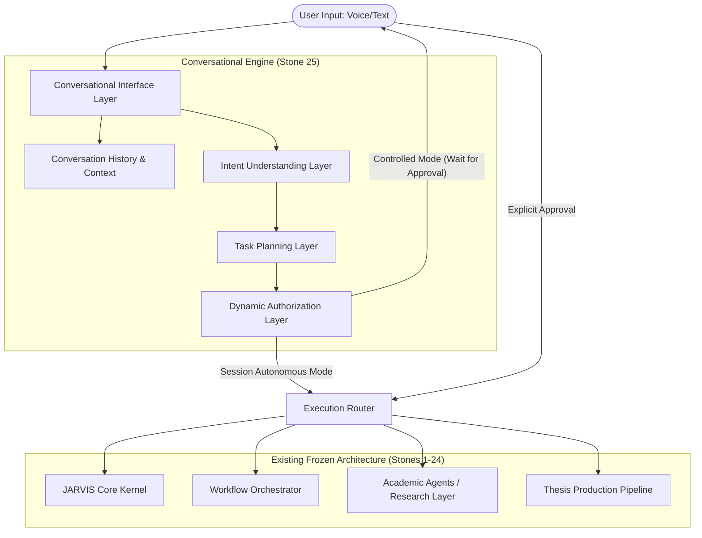

# STONE 25: JARVIS Conversational AI Assistant Proposal

## 1. Objective
Transform JARVIS Thesis OS from a command-triggered system into a conversational AI assistant capable of understanding natural language intent, formulating workflows, mapping to existing agents, and executing them dynamically with supervised autonomy.

## 2. Architecture Overview

### Architecture Diagram

### Components

#### 2.1 Conversational Interface Layer
* **Role**: Primary entry point for all user interactions (text-based, future voice-ready).
* **Responsibilities**: 
  * Ingest natural language input.
  * Maintain conversation history and track contextual references.
  * Deliver system responses and progress updates naturally.

#### 2.2 Intent Understanding Layer
* **Role**: The translation engine bridging human language and system actions.
* **Responsibilities**:
  * Semantic parsing of user prompts.
  * Extraction of structured operational metadata (e.g., `task`, `target`, `agents`).
  * Mapping ambiguous requests to predefined capabilities.

#### 2.3 Task Planning Layer
* **Role**: Translating structured intent into executable multi-step workflows.
* **Responsibilities**:
  * Selecting the appropriate sub-agents (WriterAgent, ReviewerAgent, ResearcherAgent, etc.).
  * Formulating a DAG (Directed Acyclic Graph) of operations.
  * Interfacing with the existing Workflow Orchestrator.

#### 2.4 Dynamic Authorization Layer (DAL)
* **Role**: The gatekeeper enforcing human-in-the-loop (HITL) control.
* **Responsibilities**:
  * **Default State (CONTROLLED MODE)**: Halt execution and request explicit human approval before dispatching workflows.
  * **Explicit Override (SESSION AUTONOMOUS MODE)**: Allow workflows to execute automatically if the user explicitly commanded an override (e.g., "Jarvis approve all").
  * Managing the expiration of autonomous mode upon session termination.

## 3. Data Flow

1. **Ingestion**: User issues a natural language command.
2. **Parsing**: The Conversational Interface Layer normalizes the input and appends conversation context.
3. **Intent Extraction**: The Intent Understanding Layer outputs a structured JSON payload defining the objective.
4. **Planning**: The Task Planning Layer queries the frozen architecture to construct a valid workflow.
5. **Authorization Check**:
   * If in `CONTROLLED MODE`, the Dynamic Authorization Layer sends a prompt to the user detailing the plan and awaits a response.
   * If in `SESSION AUTONOMOUS MODE`, the DAL logs the implicit approval and proceeds.
6. **Execution**: The workflow is submitted to the Core Kernel / Workflow Orchestrator for execution across Stones 1-24.

## 4. Integration Points

* **Workflow Orchestrator (Stones 1-24)**: TPL maps conversational intents to existing Workflow Orchestrator API structures.
* **Academic Agents**: IUL identifies the required agent roles registered in the existing agent registry.
* **Academic Memory & Context**: CIL queries existing Memory Layers for thesis context to resolve ambiguous user queries.
* **Thesis Production Pipeline**: TPL connects to compilation endpoints for commands like "prepare my thesis for submission."

## 5. Voice Future Compatibility

To accommodate future integration without immediate implementation:
* Inputs to the Conversational Interface Layer will use an abstract `AudioOrTextStream` interface.
* Outputs will yield a structured `SystemResponse` object containing both textual data and SSML (Speech Synthesis Markup Language) compatible tags.
* Asynchronous event hooks will be exposed for UI animation (e.g., `on_thinking`, `on_speaking`, `on_executing`).

## 6. Security Boundaries & Requirements

* **Immutability of Legacy Stones**: Stone 25 acts strictly as a *client* or *orchestrator* utilizing the existing APIs of Stones 1-24. No core logic in prior stones will be mutated.
* **Agent Isolation**: Academic Agents cannot interact with or manipulate the Dynamic Authorization Layer.
* **Prompt Injection Defense**: 
  * "Approve all" commands are strictly pattern-matched and contextually validated at the highest privilege level, uninfluenced by external document content or agent memory.
* **Session Scope**: Autonomous mode state is strictly volatile (in-memory per session) and cannot be persisted to disk.

## 7. Testing Requirements (Hostile Architecture Tests)

* **Fake Approval Attempts**: Test injecting explicit approval strings into agent memory or document contents to verify the system does not confuse data with user authorization.
* **Agent Autonomy Escalation**: Create rogue agent definitions that attempt to toggle `SESSION AUTONOMOUS MODE` via API calls, ensuring the DAL rejects them.
* **Unauthorized Workflow Execution**: Attempt to push a workflow directly to the Execution Router bypassing the DAL; verify network/API boundary rejection.
* **Context Leakage**: Ensure highly sensitive context from one distinct thesis module does not inappropriately contaminate the prompt structure of unrelated tasks.
* **Invalid Intents**: Feed contradictory or unsupported commands to ensure graceful degradation and a conversational request for clarification.

## 8. Required User Decisions Before Implementation

1. **Intent Taxonomy**: Do we want a hardcoded list of supported intents, or an LLM-driven dynamic intent router that might attempt zero-shot mappings to agents?
2. **Session Persistence**: How is a "session" defined for the expiration of Autonomous Mode (e.g., based on idle timeout, explicitly closing the terminal)?
3. **Approval Granularity**: In Controlled Mode, should the user approve the *entire* workflow upfront, or step-by-step as agents complete intermediate milestones?
4. **Agent-to-User Clarification**: If an intent is vague, should the system ask clarifying questions before building the plan, or build a best-effort plan and ask for approval?
