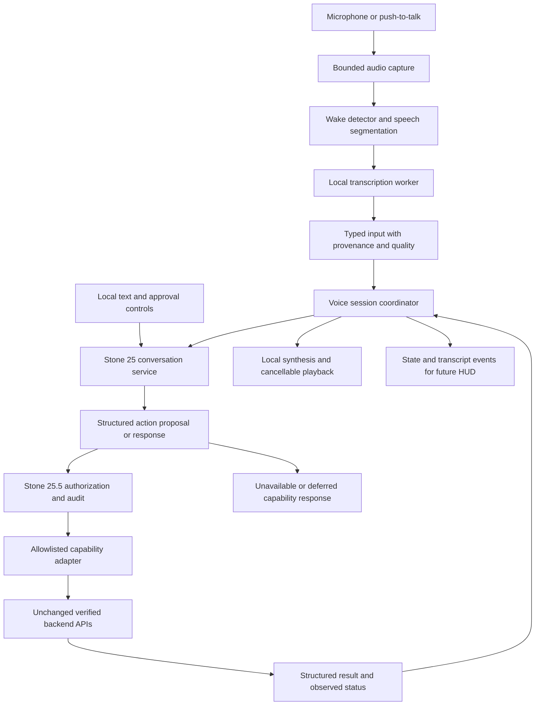

# STONE 26 — Voice Interface Layer

**Status: architecture proposal; awaiting user approval. No implementation or freeze has occurred.**

Prepared 5 September 2026 for JARVIS THESIS OS. Repository inspected: `D:\Masters\Jarvis_Thesis_OS`; branch `phase-2-jarvis-experience`; commit `e49777b252652f04791dc17535545de3521ad08b`.

## 1. Decision in brief

Add an optional Windows voice interface around the existing architecture. Preserve every existing file belonging to Stones 1–24, including the Stone 7 `voice` package, core bootstrap, runtime, configuration, dependencies, and regression tests. Extend Stone 25/25.5 only where necessary to establish a real input, approval, and dispatch contract. Do not rebuild the kernel, agent framework, knowledge system, or thesis pipeline.

The recommended design uses local Whisper-family recognition, local neural speech synthesis, acoustic “Hey Jarvis” detection, push-to-talk, interruptible playback, explicit session state, and the existing authorization layer strengthened at its public boundary. Speech confidence affects whether a transcript needs clarification; it never grants permission.

Stone 26 will demonstrate real microphone-to-response operation and a verified read-only thesis operation. It will not claim that existing simulated drafting, research, or compilation routes have become functional because they can now be spoken. Unsafe or unavailable routes remain unavailable through the new interface.

Approval of this proposal authorizes the listed Stone 26 work and bounded Stone 25/25.5 corrections only. It does not authorize changes to frozen foundations, implementation of Stones 27–30, or immediate modification of the external manuscript.

## 2. Current-state verification

The handover describes Stones 1–25.5 as complete with 306+ passing tests. The inspected checkout does not fully support that statement. The freeze is respected as a change constraint; it is not treated as proof of operational correctness.

| Evidence | Verified result |
|---|---|
| Checkout | Expected branch; commit shown above |
| Source consistency | All 337 project files from the earlier audit still match their SHA-256 hashes |
| Main regression suite, rerun for this proposal | **294 passed**, one dependency deprecation warning; 30.68 seconds |
| Conversation/security suite, explicitly rerun | **11 passed, 1 failed**; 0.17 seconds |
| Combined result | **305 passed, 1 failed; 306 tests executed** |
| Existing voice implementation | Stone 7 provides Windows System.Speech recognition/synthesis adapters, text-prefix wake detection, and test doubles |
| Stone 24 voice entry | `InterfaceGateway.process_voice_stream()` accepts simulated text, not microphone audio |
| Conversation execution | Approved requests currently return an execution announcement without invoking a workflow executor |
| Antigravity CLI | Not found on PATH; no Antigravity command was executed |
| Hardware capability | CPU/RAM/GPU queries were denied in this environment; no hardware performance claim is made |

The failing test is `16_CONVERSATION_ENGINE/tests/test_hostile_architecture.py:21`, which calls the removed `AuthorizationManager.is_autonomous()` method. Default discovery in `pytest.ini` includes only `11_TESTING/unit_tests`, omitting the conversation suite. Tests ran in an isolated source copy using the existing Python 3.14.6 environment, with model downloads disabled and generated files confined to the review workspace.

There are 173 pre-existing tracked test-artifact paths reported as deleted under `.test_tmp3`. Windows denies access to several temporary test directories. This proposal neither cleans those files nor treats their status as a development change.

Earlier source-backed behavior probes remain applicable because the reviewed files are unchanged. They showed high-confidence unconfirmed voice enabling autonomy, missing permission-registry enforcement, writing scope used for a research request, and approval state not surviving an ordinary request/“yes” exchange. Broader backend findings include inconsistent manuscript roots, stubbed model/memory connections, fixed academic quality scores, and a failed workflow becoming completed on another step.

This verification establishes a reproducible baseline, not certification of all Stones or a live hardware validation. No external thesis, microphone, online research provider, or real manuscript compilation was exercised.

Related review artifacts: [full analysis](Jarvis_Thesis_OS_Analysis.md), [file index](Jarvis_Thesis_OS_File_Index.md), and [earlier test/probe evidence](Jarvis_Thesis_OS_Verification.md). Fresh baseline output is included in section 15.

## 3. Scope and acceptance outcome

The Stone 26 user journey is:

1. Start the optional voice launcher; see microphone, speech-model, playback, and backend capability status.
2. Enable listening explicitly, or hold push-to-talk. Say “Hey Jarvis” in wake mode.
3. Receive an audible cue and visible listening state.
4. Speak a request; see the recognized transcript and any required clarification.
5. Receive a real result for an enabled capability, an approval request for a proposed operation, or an accurate explanation that the capability is unavailable.
6. Hear a concise response. Interrupt speech, cancel a pending request, or mute the microphone.
7. Restart into controlled mode with no approvals or autonomous scopes restored.

Required capabilities are microphone capture; local transcription; local speech output; acoustic wake detection; push-to-talk; device selection; session lifecycle; recognition-quality assessment; authorization integration; cancellation; observable errors; and tests with both deterministic fixtures and actual laptop audio.

The first real backend operation will be a read-only citation/structure inspection through the existing `ThesisWorkspaceManager`, constructed with an explicitly validated thesis root by the new adapter. A fixture with known citations will establish correctness before any read-only real-manuscript demonstration. Status queries and cancellation are also supported.

Natural multi-agent planning, new academic generation, paper discovery, complete compilation/export, a graphical HUD, and slide production remain later roadmap work. English is the proposed initial acceptance language, based on the repository configuration; additional languages require corresponding recognition and voice fixtures.

## 4. Architecture and ownership



There is one authority for action approval: the Stone 25.5 authorization service. The voice worker, language model, agent response, retrieved document, and memory record never own this authority. The new adapter enforces the authorization decision immediately before dispatch; it does not create its own independent permission system.

**Audio worker.** A separate process owns capture, wake detection, recognition, synthesis, and playback. It accepts only a bounded speech protocol and cannot request arbitrary backend methods. This isolates optional speech dependencies and permits a hung inference process to be terminated without changing the frozen runtime environment. This is dependency/failure isolation, not a claim of a hostile-code sandbox against processes running as the same Windows user.

**Session coordinator.** Lives with the conversation service and owns session IDs, turn IDs, cancellation, microphone state, and routing. It treats worker transcripts as untrusted input, ignores unknown protocol messages, and discards late results from cancelled turns. It launches workers using a fixed executable and argument list, without a shell command built from speech.

**Backend adapter.** Exposes explicit capability IDs and typed parameters. It maps enabled read-only operations to existing public APIs; it does not forward arbitrary speech to `process_workflow()` or a generic runtime command string. It verifies actual results before reporting completion. Unsupported agent routes are not registered as executable.

**Compatibility.** Preserve existing `VoiceManager` and legacy entry points unchanged. Reuse suitable Stone 7 transfer types/protocols through adapters, but do not use the legacy manager's direct kernel dispatch for the new approval-sensitive path. Avoid runtime monkey-patching. Only one microphone owner is started by the new launcher.

## 5. Proposed file boundary

Folder numbering follows the existing convention: Stone 25 lives under `16_CONVERSATION_ENGINE`; Stone 26 is proposed under `17_VOICE_INTERFACE`. No `26_...` duplication is introduced.

| Location | Proposed work |
|---|---|
| `17_VOICE_INTERFACE/jarvis_voice/` | New coordinator, state/data contracts, audio worker, capture/playback, provider adapters, wake handling, quality policy, events, launcher, backend adapter |
| `17_VOICE_INTERFACE/tests/` | Unit, integration, adversarial, lifecycle, audio-fixture, and manual hardware test definitions |
| `17_VOICE_INTERFACE/voice_config.example.yaml` | Separate opt-in configuration; no edit to frozen `jarvis_config.yaml` |
| `17_VOICE_INTERFACE/requirements-voice.lock` | Exact versions and hashes after Windows compatibility validation; no edit to frozen `requirements.txt` |
| `17_VOICE_INTERFACE/model_manifest.json` | Model identifiers, revisions, checksums, language, provenance, and notices; no model binaries committed |
| `17_VOICE_INTERFACE/README.md` | Installation, model provisioning, proposed launcher, troubleshooting, privacy controls, and verification instructions |
| `16_CONVERSATION_ENGINE/conversation_core/` | Structured response/proposal contract and persistent-in-session pending approvals; preserve legacy string API through an adapter |
| `16_CONVERSATION_ENGINE/authorization/` | Provenance-aware approval handling, exact target/scope binding, expiry, one-time consumption, and immediate revalidation |
| `16_CONVERSATION_ENGINE/security/` | Correct voice-source handling and enforce actual capability permissions; extend existing audit ownership and safe recovery |
| `16_CONVERSATION_ENGINE/tests/` | Correct the obsolete scoped-authorization assertion and add tests that reproduce the real boundary failures |
| Root Stone 26 documents | Proposal, implementation report, validation audit, and freeze manifest after their respective gates |

Changes inside Stone 25/25.5 are a specific approval decision because simply placing a wrapper around its current approval flow would preserve the defects. Approval is not inferred from the word “complete” in the handover.

Every pre-existing authored file outside `16_CONVERSATION_ENGINE` is protected from modification for this stone. New Stone 26 files and reports are additive. Tests under `11_TESTING`, old configuration, package pins, bootstrap, and all frozen modules retain their hashes. If a required capability cannot be implemented through supported APIs without touching frozen code, report the exact dependency and defer it; do not silently thaw a Stone.

The original CLI remains unchanged. The new launcher will live under the new package and use a documented explicit import path or local script. No claim is made that this proposed command exists today.

## 6. Speech providers and deployment

| Function | Recommended choice | Delivery policy |
|---|---|---|
| Speech recognition | `faster-whisper`, CPU INT8 initially; benchmark multilingual `base` and `small` candidates | Load a pinned local model; choose the final default from measured accuracy/latency |
| Speech synthesis | Piper, with a selected installed voice | Use a local model; validate pronunciation and interruptible playback on Windows |
| Wake detection | openWakeWord ONNX “Hey Jarvis” candidate | Acoustic detector after explicit listening enable; tune on recorded local fixtures |
| Audio I/O | `sounddevice`/PortAudio candidate | Validate selected Windows devices and sample conversion during compatibility work |
| Speech segmentation | Local voice activity detection | Bound utterances and distinguish silence from speech; exact provider pinned after compatibility work |
| Degraded speech output | Existing Windows System.Speech adapter where lifecycle tests permit | Explicit degraded status; never silently replace recognition with a mock |

The faster-whisper project documents CPU INT8 operation and local-directory model loading; its published benchmarks are not forecasts for this laptop. [Official faster-whisper documentation](https://github.com/SYSTRAN/faster-whisper).

Piper is a local neural TTS engine; its current project declares GPL-3.0. Voice models carry their own model-card terms, so the selected model and notices must be recorded before distribution. [Official Piper project](https://github.com/OHF-Voice/piper1-gpl), [official voice guidance](https://github.com/OHF-Voice/piper1-gpl/blob/main/docs/VOICES.md).

openWakeWord documents Windows ONNX operation, a “Hey Jarvis” model, and 16 kHz PCM input. Its code and bundled pretrained models have different licenses: Apache-2.0 for code and CC BY-NC-SA 4.0 for bundled models. The proposed pretrained model is therefore a personal prototype candidate, not a blanket redistribution choice. [Official openWakeWord documentation](https://github.com/dscripka/openWakeWord).

These are provider selections proposed for validation, not dependencies installed during this task. Coqui remains an alternative behind the synthesis contract; multiple TTS engines are not a first-delivery requirement.

The sounddevice installation guide documents bundled PortAudio installation through pip on Windows. Device availability and the chosen package version still require local validation. [Official sounddevice installation guide](https://python-sounddevice.readthedocs.io/en/latest/installation.html).

Keep the existing Python 3.14.6 environment untouched. Provision a separate speech-worker environment only after approval. Python 3.12 is a compatibility candidate, not a verified requirement: installation must first prove that the selected versions have compatible Windows wheels and pass offline model smoke tests. If that fails, revise the provider/environment choice before implementation depends on it.

Use inherited anonymous pipes for a versioned, size-limited message protocol; no listening network server is needed for Stone 26. The coordinator starts the worker and holds the pipe handles. Transcript messages cannot impersonate local approval-control messages. A future Stone 27 bridge must preserve that distinction.

Model downloads are a visible setup step with pinned revisions and checksum verification. Normal voice operation must succeed with network access disabled after setup. Missing models produce an actionable unavailable state rather than a download during conversation. No cloud fallback is enabled by this proposal.

## 7. Audio and session behavior

Proposed capture defaults are mono 16 kHz PCM internally, with explicit conversion from the device format; a two-second in-memory ring buffer; a 30-second maximum utterance; and a ten-second timeout after activation with no usable speech. These are initial engineering settings to tune, not established performance measurements. Bound queue sizes; on overload discard the current turn and ask for repetition rather than acting on an incomplete transcript.

The coordinator uses explicit states: `STOPPED`, `MUTED`, `READY`, `LISTENING`, `TRANSCRIBING`, `CLARIFYING`, `WAITING_FOR_APPROVAL`, `EXECUTING`, `SPEAKING`, and `ERROR`. Execution status and playback status are tracked separately so speech can stop while a backend operation remains active.

| Event | Required transition/behavior |
|---|---|
| Startup | Controlled authorization; no active approval; microphone closed until enabled |
| Wake/PTT activation | New turn ID; listening cue; bounded capture |
| Silence, uncertain chapter name, malformed audio | No dispatch; clarification or return to ready |
| Partial transcript | Display only; never used to execute or approve |
| Final transcript | Preserve provenance and quality; propose an action through conversation service |
| Approval needed | Retain one exact pending proposal; display target and operation |
| Stop playback | Halt output and clear queued speech; do not claim backend cancellation |
| Cancel operation | Request cooperative cancellation; report cancelled only after acknowledgement |
| Mute/device removal | Close capture; invalidate uncommitted voice turns and pending voice confirmations |
| Worker failure | Stop playback, discard its incomplete turn, clear authorization state, show degraded status |
| Restart/shutdown | Revoke approvals/scopes; close devices, drain or discard queues, terminate/join workers with deadlines |

For the baseline speaker mode, pause command recognition during synthesized speech to prevent feedback loops. A local Stop/PTT control interrupts immediately and opens a fresh turn. Headset mode may permit speech-driven interruption after a dedicated echo/replay test. Do not promise reliable full-duplex speaker interruption until acoustic echo handling has passed the acceptance tests. If it cannot pass, clearly report the limitation and retain push-to-talk interruption.

Response wording is concise and consistent: acknowledge listening, explain ambiguity, identify an approval target, and state observed outcomes. Personality changes wording and voice settings, not authority. Do not read arbitrary LaTeX source, paths, or large retrieved passages aloud unless requested; summarize with access to the full text response.

## 8. Recognition confidence is not authorization

Use a new internal transcript envelope containing session/turn IDs, origin, final/partial status, language, timestamps, wake/PTT activation evidence, provider diagnostics, quality band, and text. Origin is set by the receiving transport, never accepted from a transcript string or restored memory.

Whisper-family diagnostics are not a calibrated probability that a command is correct. Preserve available model diagnostics and assign `HIGH`, `UNCERTAIN`, or `REJECT` only through a documented policy tested against fixtures. Missing diagnostics are unknown, not confidence 1.0. Do not directly copy Stone 7's default confidence into an authorization decision.

Evaluate content needed for the action separately: a clear sentence with an uncertain chapter number still requires clarification. No-speech output, invalid/non-finite values, out-of-range scores, truncation, unsupported language, and expired turns must not dispatch.

Wake detection means “begin listening.” Push-to-talk means “the user opened capture.” Neither proves identity or approves an operation. Recorded speech can satisfy a wake detector; this design does not claim biometric authentication or guaranteed replay detection.

## 9. Authorization, permissions, audit, and memory

The flow is **interpret → propose → authorize → revalidate → dispatch → record observed result**. Text, voice, and later HUD callers must use the same action service. Memory and agent output are always data-only inputs.

| Request class | Stone 26 policy |
|---|---|
| Status/help, verified read-only inspection | May execute after valid activation and target resolution, within the enabled capability allowlist |
| Clarify target or cancel pending proposal | Voice allowed; cancellation cannot enlarge permissions |
| Approve a read-only continuation | May use a fresh voice response bound to the displayed pending request |
| Write/edit, compile, export, external action | Requires an explicit local text/control confirmation of the exact action; remains unavailable if the backend capability is not validated |
| Enable/expand autonomous scopes | Local text/control confirmation only; voice may ask to display the scope proposal |
| Delete files, OS modification, arbitrary command execution | Not exposed by Stone 26 |

For write-capable future adapters, confirmation binds the proposal ID, session, capability, agent, canonical target root/path, payload or diff digest, source version, and expiry. A changed target/content or expired proposal requires a new approval. Consume approvals once, recheck scope and agent permissions just before dispatch, and reject unknown agents/actions. A bare “yes” without an active matching request has no effect.

Pending approvals and scoped autonomy exist only in volatile session state. Default to no active scopes, with a proposed maximum scope duration of 15 minutes for the new voice session. Grant/revoke scopes only through the authorization service. Do not revive scopes from preferences, transcripts, audit records, or crash recovery. Mute, restart, session end, and explicit revocation clear pending voice authority; worker failure returns the new session to controlled mode.

Strengthen the existing ledger through the authorization service rather than adding a competing ledger. Capture request IDs, actor origin, capability, target digest, policy decision, scope, and execution outcome. Expose no write handle or caller-name authorization mechanism to agents. Durable audit records can survive restart but cannot restore authority. Hash chaining detects some alteration; a local same-user process can still rewrite/delete files. Do not label the ledger tamper-proof. Write-capable dispatch must stop if the required decision audit cannot be recorded.

Audio is held only in bounded memory buffers by default and released on completion/cancellation. Transcripts remain session-local by default. Preferences may persist as user-approved data such as language, device, rate, and voice, but never as an authorization state. Diagnostic audio/transcript capture is explicit, time-limited, visible, and separately removable. Audit records use minimal structured data rather than full audio or unnecessary thesis text.

## 10. Existing backend defects and the freeze

| Dependency | Stone 26 treatment |
|---|---|
| Stone 25.5 promotes unconfirmed speech to confirmed | Correct in the approved Stone 25.5 change boundary; mandatory before live microphone integration |
| Missing pending approval/permission dispatch contract | Correct Stone 25/25.5 interfaces; use a real allowlisted adapter, never simulated approval arguments |
| Frozen bootstrap uses inconsistent thesis roots | New read-only adapter constructs existing workspace API with an explicit validated root; no bootstrap edits |
| Frozen file adapter manufactures confirmation | Do not expose it through voice; write capability remains disabled |
| Frozen workflow terminal-state defect | Do not rely on that executor for Stone 26's read-only operation; defer affected workflow execution |
| Fixed quality scores, synthetic evidence, disconnected model gateway | Do not use these outputs as completion/approval signals; report generation/reasoning capability unavailable |
| Incomplete compilation path containment/build cycle | Compilation requests may be captured as proposals but cannot execute through Stone 26 |

Later Stones cannot be certified complete while depending on these defective paths. A later proposal must either use a demonstrated supported adapter around unchanged foundations or seek an explicit narrowly scoped freeze exception. This proposal grants neither a freeze exception nor permission to hide these dependencies behind optimistic status messages.

## 11. Validation and freeze criteria

Tests must verify observable behavior through real component boundaries, not only mocked strings or declared class names.

| Area | Required evidence |
|---|---|
| Frozen baseline | Original 294 tests pass unchanged; protected source hashes unchanged |
| Conversation/security | Existing conversation suite passes after the documented assertion correction; new behavioral regressions cover the defects |
| Real read-only integration | Audio fixture → final transcript → conversation → authorization policy → real workspace inspection → expected missing-citation result → speech output |
| Approval binding | Wrong/expired/replayed/session-mismatched proposal, changed target/diff, and bare “yes” cannot dispatch |
| Provenance | High-confidence unconfirmed speech, agent text, memory instructions, worker spoofed origin, and assistant playback cannot grant authority |
| Scope/permissions | Wrong scope, unknown capability, wrong agent and write-vs-compile mismatch denied at actual dispatch |
| Recognition | Silence, background speech, noise, accents, chapter numbers, technical terms, partial utterances, and missing diagnostics |
| Lifecycle | Stop/start cycles, mute, unplug, sleep/resume, inference timeout, worker crash, cancellation race and late result rejection |
| Storage/privacy | No raw audio or transcript persisted by default; no authority restored from disk; corrupt audit/recovery state handled explicitly |
| Offline/dependencies | Clean speech environment, model checksum verification, missing-model errors, and real provider operation with network disabled |
| Capability honesty | Unavailable drafting/compilation returns unavailable; no execution announcement without accepted dispatch/result evidence |

Proposed hardware targets, to measure and revise explicitly if unattainable: wake-to-listening-cue p95 under 400 ms; final transcription p95 under three seconds after a 5–10 second utterance ends; first speech audio p95 under one second for a short response with models warm; local Stop/PTT playback interruption p95 under 250 ms. Measure backend processing separately. Cold startup/model loading is reported separately, not excluded silently.

Use a declared fixture set of at least 100 intended commands, including accents and chapter/citation terms, plus at least two hours of representative non-command audio. Target at least 95% correct actionable intent-and-target recognition on the quiet-room command set, at least 95% wake detection on intended activations, and no more than one false wake in the ambient set. Report errors and denominators; these samples are acceptance evidence, not guarantees about all future environments. Security fixtures must produce zero unauthorized dispatches.

Hardware checks require the actual microphone/speakers and the selected voice/model. Passing mock tests is insufficient to freeze real voice support. If a device/provider cannot be exercised, mark that acceptance item blocked, not passed. Performance values above are proposed targets, not promises based on uninspected hardware.

A new Stone 26 test runner will explicitly invoke the frozen suite, conversation suite, and new suite without changing `pytest.ini`. Do not delete tests, lower their assertions, or blanket-xfail failures to achieve a green count. Record exact commands, environments, versions, result counts, model hashes, known limitations, and frozen-file comparisons in the validation audit.

## 12. Implementation sequence after approval

1. **Compatibility and baseline gate:** resolve Antigravity CLI availability, snapshot protected files, validate optional provider installation in a separate environment, and record model/voice choices. No models are provisioned by this proposal itself.
2. **Authorization contract gate:** implement the bounded Stone 25/25.5 corrections and adversarial tests before allowing live voice input to reach actions.
3. **Typed session and adapter gate:** implement cancellation/provenance/state contracts with deterministic providers and one real read-only backend capability.
4. **Local audio gate:** add capture, segmentation, acoustic wake detection, transcription, synthesis, playback cancellation, and device/error handling.
5. **Windows demonstration gate:** validate real hardware, offline behavior, latency, recognition, feedback handling, and the end-to-end read-only fixture.
6. **Documentation and audit gate:** produce `STONE_26_IMPLEMENTATION_REPORT.md`, then `STONE_26_VALIDATION_AUDIT.md`, run all regressions, and present remaining limitations.
7. **Freeze gate:** freeze only after acceptance evidence is complete and the Stone workflow's user sign-off is recorded. A freeze manifest binds source/model/config/test evidence to the reviewed revision.

Preserve the requested Antigravity CLI workflow. Because the executable is not on PATH, its location or installation must be resolved before claiming to use it for implementation. Repository inspection, tests, and this proposal were produced with the available local tools. No agent delegation, code implementation, dependency installation, or microphone activation occurred during this proposal task.

## 13. Handoff to Stones 27–30

| Stone | What Stone 26 supplies | What remains for that Stone |
|---|---|---|
| 27 — HUD | Versioned state/transcript/playback/task events and local approval contracts | Desktop renderer, visual design, accessible controls, protected backend bridge |
| 28 — AI copilot | Input provenance, multi-turn approval state, structured capability requests | Actual model integration, contextual planning, agent selection, source-backed generation |
| 29 — production | Dispatch boundary, cancellation protocol, audit/result contracts | Verified research-to-export workflow and resolution of frozen backend dependencies |
| 30 — experience | Real voice loop and measured device behavior | Cohesive product integration, defense artifacts, distribution, and final user acceptance |

No later Stone is implemented or considered approved by approving this voice proposal.

## 14. User decisions required

Approval can accept the recommended package below or name specific changes:

| Decision | Recommended selection |
|---|---|
| Change boundary | New `17_VOICE_INTERFACE` plus explicitly listed Stone 25/25.5 corrections; zero changes to Stones 1–24 |
| Providers/deployment | Local faster-whisper + Piper + openWakeWord, separate optional worker environment, CPU-first validation |
| Initial language and voice | English; select an installed/model voice during setup from actual audible samples |
| Activation/privacy | Push-to-talk available immediately; wake mode only after explicit enable; no retained audio by default |
| Approval policy | Voice for requests/clarification; local text/control confirmation for writes, compile/export and scope changes |
| Backend scope | Real read-only thesis inspection first; unavailable frozen workflows clearly deferred |
| Tooling | Resolve Antigravity CLI location/setup before implementation; do not silently substitute a claimed Antigravity run |

**Approval question:** Do you approve this Stone 26 architecture and its listed change boundary, or what would you like changed?

This gate comes directly from the user's instruction: “Do not implement until architecture approval.” It is not an inferred skill requirement. No implementation report or validation audit for Stone 26 has been created because there is no implementation to report or certify yet.

## 15. Fresh verification output

Main suite on the isolated, source-matching review copy:

```text
294 passed, 1 warning in 30.68s
Warning: chromadb telemetry uses asyncio.iscoroutinefunction,
which is deprecated in the current Python environment.
```

Explicit conversation/security suite:

```text
FAILED 16_CONVERSATION_ENGINE/tests/test_hostile_architecture.py::TestHostileArchitecture::test_agent_autonomy_escalation
AttributeError: 'AuthorizationManager' object has no attribute 'is_autonomous'
1 failed, 11 passed in 0.17s
```

Source verification:

```text
Reviewed authored files checked against earlier SHA-256 inventory: 337
Changed authored files: 0
Branch: phase-2-jarvis-experience
HEAD: e49777b252652f04791dc17535545de3521ad08b
Antigravity CLI: not on PATH
CPU/RAM/GPU inventory: access denied; hardware performance not verified
```

Fresh test logs are retained in the review workspace. Source and external manuscript files remain unchanged.
